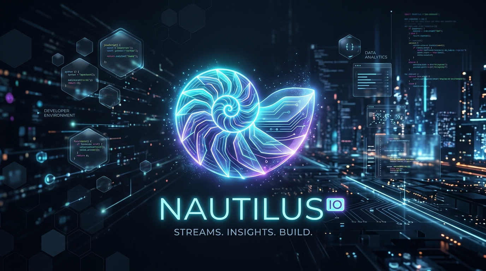

# nautilus

<p align="center">
  
</p>

Nautilus is a high-performance, Rust-powered monorepo engineered to unify software deployment pipelines into a single ecosystem. From source acquisition to Kubernetes deploy, work seamlessly via **Nautilus Deck**—a keyboard-first terminal UI—or **Nautilus Studio**, a breathtaking Tauri desktop GUI featuring sleek glassmorphism and an interactive execution canvas. Fast, graph-based, and built for ultimate control.

<p align="center">
  <em>(TODO: Add a GIF of Nautilus Studio running a pipeline here)</em><br>
  <em>(TODO: Add a GIF of Nautilus Deck TUI here)</em>
</p>

## ✨ Core Features
- **Engine (`nautilus-core`)**: A headless DAG (Directed Acyclic Graph) engine equipped with cycle detection, parallel task scheduling via Tokio, and built-in daemonless Docker/Kubernetes integration plugins.
- **Nautilus Deck (`nautilus-cli`)**: A blazing-fast 60FPS Terminal UI built on `ratatui` featuring Vim-style keyboard navigation, dynamic pipeline viewing, and high-throughput log tailing.
- **Nautilus Studio (`nautilus-studio`)**: A beautiful, cross-platform Tauri v2 desktop application. Features a fully animated `React Flow` Pipeline Canvas with auto-layout, streaming IPC event logs, and a responsive TailwindCSS v4 glassmorphism shell.

---

## 🧑‍💻 User Guide

### 1. Installation
Currently, Nautilus provides pre-built native binaries via our automated GitHub Actions CI pipeline on the Releases page:
- **Nautilus CLI:** Download the lightweight terminal executable (`.exe`, `.tar.gz`) for your OS and add it to your system PATH.
- **Nautilus Studio:** Download the native Desktop Installer (`.msi`, `.dmg`, `.AppImage`), run it, and launch the GUI natively on your machine!

*(Note: Binaries may trigger SmartScreen/Gatekeeper warnings during early releases until we integrate EV Code Signing).*

### 2. Getting Started
To get started from the terminal, simply run the executable in your directory:

```bash
nautilus run
```

If you don't provide a pipeline file, Nautilus will automatically generate a default `pipelines.yml` template for you in your current directory! It looks like this:

```yaml
version: "1.0"
pipeline:
  name: "Default Pipeline"
  stages:
    - id: "hello"
      plugin: "shell"
      args:
        command: "echo 'Hello from Nautilus!'"
```

You can then edit this `pipelines.yml` and trigger it again with `nautilus run`.
If you want to use a specific file name, you can pass it directly:
```bash
nautilus run my-custom-pipeline.yml
```

Alternatively, open **Nautilus Studio**, load your workspace, and interact with the pipeline canvas to trigger executions with a single click.

---

## 🛠️ Developer Guide

### 1. Architecture Overview
Nautilus is a Cargo Workspace containing three primary integrated crates:
- `nautilus-core`: The headless DAG execution engine, state manager, and trait-based plugin system.
- `nautilus-cli`: The terminal user interface (TUI) and argument parser built on top of `clap`.
- `nautilus-studio`: The React/TypeScript frontend wrapped in a Tauri v2 desktop shell.

### 2. Development Setup

#### Prerequisites
- Rust (`rustup` with the latest stable version).
- Node.js (v20+ for Nautilus Studio frontend).
- Platform-specific build tools (e.g. C++ build tools for Windows, `build-essential` & `libwebkit2gtk-4.1-dev` for Linux).

#### Building the Monorepo
You can build and test the entire Rust workspace at once:
```bash
cargo build --workspace
cargo test --workspace
```

#### Running Nautilus Studio locally
```bash
cd crates/nautilus-studio
npm install
npm run tauri dev
```

### 3. Adding a Plugin
Plugins implement the asynchronous `Plugin` interface located in `nautilus-core`. Create a new struct under `crates/nautilus-core/src/plugin/builtins/`, implement `execute(&self, ctx: &ExecutionContext, ...)` and define your logic natively in Rust!

---

## 📬 Let Us Know You're Using Nautilus!

Nautilus is open-source software released under the [Apache 2.0 License](./LICENSE). 

If you or your organization are using Nautilus in production, integrating it into your infrastructure, or building custom tooling on top of it, **we would love to hear from you!**

Reporting your usage helps us gauge adoption, prioritize core feature development, and support the project's long-term sustainability.

* **Open a Github Issue:** Drop a quick note in our [Adoption Registry](https://github.com/Siaco/nautilus/issues).
* **Direct Email:** Send a short note to `pastura.camillofrancesco@gmail.com`.